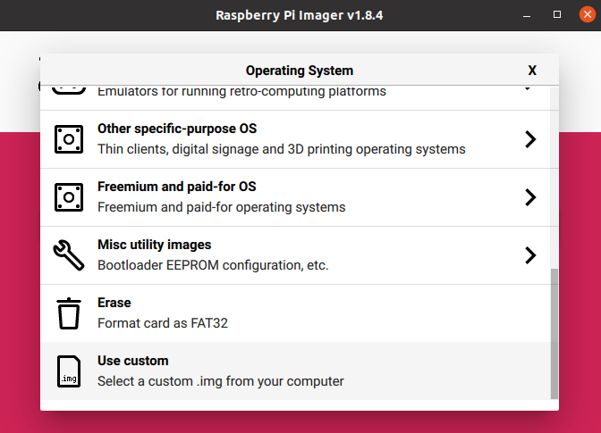

# __A cross-compilation guide for Qt5.15.12 for Raspberry Pi 4 running Raspberry Pi OS Bullseye__
This page documents an easy to follow guide to cross-compile the latest version of Qt5 (Qt5.15.12) for a Raspberry Pi 4 running Bullseye.  
I have been using Raspberry Pi OS Buster for quite some times, and it was easy to get Qt5 running on it thanks to the plethora of guides available. After I moved to Bullseye, I quickly found out that most of the guides do not work anymore because some majors changes between the two versions. After days of experimentation, building, erasing, rebuilding ... I finally got everything right. And I decided to put all the steps here, to save time for anyone else interested in building Qt5 for a Raspberry Pi 4 running Bullseye.

## __Setup__
### __Hardware__
Host: Ryzen 5 4000 + 16 GB RAM + RTX 3060
Target: Raspberry Pi 4 Model B.

### __Software__
Host: Ubuntu 20.04 LTS 64 bit.
Target: Raspberry Pi OS Bullseye 32 bit.
Cross compiler: gcc-linaro-7.4.1-2019.02-x86_64_arm-linux-gnueabihf.

<u>__Notes__</u>:  
- A Ubuntu virtual machine can be used if you don't have it installed.
- The process requires at least 10 GB of disk space
- Make sure thatt your Raspberry Pi is on the same network as your host PC and that it has internet access.
- This guide is only for
Raspberry Pi4. It can be used for the Raspberry Pi 3 Model B (change the -device argument to linux-rasp-pi3-vc4-g++ in the configure step) though I did not tested that. Same for Raspberry Zero 2W. If you succeed in building for those, let me know so I can update the guide.  
I personally used the 32 bit desktop version of Bullseye, and I didn't have the time to test it on the 64 bit version yet. If you succeed to build for the other versions, please let me know so that I can update this guide.


## __Acknowledgements__
This guide is highly inspired by the one published by @UvinduW for [cross-compiling Qt5 for Raspberry 4 running Buster](https://github.com/UvinduW/Cross-Compiling-Qt-for-Raspberry-Pi-4). It has been my reference guide for cross-compiling Qt for all Raspberry Pi variant under Buster.

## __1 Flash an SD Card with the Raspberry Pi OS image__
If you already have a Bullseye image running, you can skip this section.  

The Raspberry Pi Foundation has made the flash process very easy bu providing the [Raspberry Pi Imager](https://www.raspberrypi.com/software/). It allows setting up the user credentials, SSH, and WiFI configuration at the same time.
Follow the link to grab the latest version and install it.  
- Use [this link](https://downloads.raspberrypi.com/raspios_oldstable_armhf/images/raspios_oldstable_armhf-2023-12-06/2023-12-05-raspios-bullseye-armhf.img.xz?_gl=1*18pubvb*_ga*MTI0NzA5MzgzNC4xNjkxMzI5Mjkz*_ga_22FD70LWDS*MTcwNjAwNjQwMi4zNC4xLjE3MDYwMTE1MTMuMC4wLjA.) to download the 32 bit desktop version.
- Run the Raspberry Pi Imager, and click __CHOOSE OS -> Use custom__ to pick the downloaded file.
- Choose your device, and click Next.
- Click __EDIT SETINGS__ customize the installation (WiFI, SSH).
  - Use the **_General_** tab to set a hostname, a username and password, Configure the WiFI, ...
  -  Under the **_Services_** tab, check the **Enable SSH** box.
  - Click __SAVE__ to save the configs.
- Click __YES__ to continue, then confirm the flash operation and wait for the process to complete.



The Imager can also download automatically the OS itself before flashing it, but I prefer the manual method, as it is faster.

## __2 Configure the Raspberry Pi__
### __2.1 Enable Development Sources__
Power up your Raspberry Pi and use SSH to log into it from your Host. If you have a display and keyboard connected to your Pi, you can also run the following commands directly on it.

The build process requires some packages to be downloaded from development sources. You first need to enable development sources in the source list. Enter the following command into a terminal.  
```
sudo nano /etc/apt/sources.list
```
That will open the file inside a nano editor. Locate the following line and uncomment it by removing the # character (add it if it does not exist):
```
deb-src http://raspbian.raspberrypi.org/raspbian/ bullseye main contrib non-free rpi
```
Now, press `Ctrl+S` to save the file, and `Ctrl+X` to quit.

### __2.2 Update the system__
Run the following commands to update the system and reboot.
``` 
    sudo apt-get update
    sudo apt-get dist-upgrade
    sudo reboot
```

### __2.3 Enable rsync with elevated rights__
Later in this guide, we will be using `rsync` to sync files between the PC and Pi. Some of these files required root rights.
Here, we will configure the Pi to grand this right to the `rsync` command.  
First, use the following command to find the path to rsync:
```
which rsync
```
On my Pi (and most probably on yours), this command outputs:
```
/usr/bin/rsync
```
Now, open the sudoers file with:
```
sudo visudo
```
The file should be opened with the nano editor. At the end of the file, add an entry with the following structure:
```
 <username> ALL=NOPASSWD:<path to rsync>
 ```
 In my case, it was:
 ```
 pi ALL=NOPASSWD:/usr/bin/rsync
 ```

 rsync is now granted root rights.
### __2.4 Install the development packages__
Run the following commands to install the packages required to build Qt.
```
sudo apt-get build-dep qt5-qmake
sudo apt-get build-dep libqt5gui5
sudo apt-get build-dep libqt5webengine-data
sudo apt-get build-dep libqt5webkit5
sudo apt-get install libudev-dev libinput-dev libts-dev libxcb-xinerama0-dev libxcb-xinerama0 gdbserver
sudo apt-get install libgles2-mesa-dev libgbm-dev libdrm-dev

```
At this stage, you might be prefer making a backup of your SD card so that you could revert back if something wrong happen later on. In my case I used 'Win32DiskImager' for this purpose (Yeah, I have Windows in dual-boot 😉).

If you want to include Qt Multimedia or Bluetooth in the build, you can run the following commands to install the requires packages (I did, and everything went well).
```
sudo apt-get install gstreamer1.0-plugins*
sudo apt-get install libgstreamer1.0-dev  libgstreamer-plugins-base1.0-dev libopenal-data libsndio7.0 libopenal1 libopenal-dev pulseaudio
sudo apt-get install bluez-tools
sudo apt-get install libbluetooth-dev
```
### __2.5 Create a directory for the Qt install__
You need to create a directory where Qt will be deployed on the Raspberry Pi once it is built.  
Run the following command to do so:
```
sudo mkdir /usr/local/qt5.15
sudo chown -R pi:pi /usr/local/qt5.15
```
## __3 Configure the Host__
The following set of instructions will be done on your host machine to configure it for the build.
### __3.1 Update the host__
Run the following commands to update your system and install some packages required by the build process.
```
sudo apt-get update
sudo apt-get upgrade
sudo apt-get install gcc git bison python gperf pkg-config gdb-multiarch
sudo apt install build-essential
```

### __3.2 Setup SSH keys for password-less connection to the Raspberry Pi__
To avoid providing a password everytime you connect to the Pi, you can configure your system to use SSH keys.  
First, check if you already have an SSH key on your host by runnning:
```
ls ~/.ssh/ | grep id_rsa
```
If your output the files `id_rsa` and `id_rsa.pub` are included in the output, then there is already an SSH key on your host. In that case, you need to copy it to your Pi using:
```
ssh-copy-id <username>@<raspberrypi-address>
```
`<raspberrypi-address>` can be the IP or the local  hostname of your Pi (that you set during the flash process). In my case, it the hostname was raspi4, so I had to enter:
```
ssh-copy-id pi@raspi4.local
```
You will be asked to provide the password of the Pi user.  
And that's it, you can now use SSH to connect to your Pi without any password.

On the other hand, the `ls ~/.ssh/ | grep id_rsa` command did not give the expected output, then your host has  no existing SSH keys and you can follow the guide provided in the [Raspberry Pi documentation](https://www.raspberrypi.com/documentation/computers/remote-access.html#passwordless-ssh-access)  to setup one.

### __3.3 Setup the directory structure__
On the host computer, all the file related to the cross-compilation will be kept inside a `rpi4` directory.
Use the following commands to create that directory and its structure:
```
mkdir ~/rpi4
mkdir ~/rpi4/build
mkdir ~/rpi4/tools
mkdir ~/rpi4/sysroot
mkdir ~/rpi4/sysroot/usr
mkdir ~/rpi4/sysroot/opt
cd ~/rpi4
```
The last command should change your current directory to ~/rpi4. Ensure that you are in that directory before going on with the rest of the instructions.

## __4 Build preparation and Build__
### __4.1 Download Qt sources__
Here we download the latest available version of Qt5.15 (Qt5.15.12).  
To download the source files, run:
```
wget http://download.qt.io/archive/qt/5.15/5.15.12/single/qt-everywhere-opensource-src-5.15.12.tar.xz
```
Extract the archive with:
```
tar xfv qt-everywhere-opensource-src-5.15.12.tar.xz
```
The mkspec within needs to be slightly modified so that we can use our cross-compiler with it. Run the following the perform the required modifications:
```
cp -R qt-everywhere-src-5.15.12/qtbase/mkspecs/linux-arm-gnueabi-g++ qt-everywhere-src-5.15.12/qtbase/mkspecs/linux-arm-gnueabihf-g++
sed -i -e 's/arm-linux-gnueabi-/arm-linux-gnueabihf-/g' qt-everywhere-src-5.15.12/qtbase/mkspecs/linux-arm-gnueabihf-g++/qmake.conf
```

### __4.2 Download the cross-compiler__
Here, we will download the cross compiler to be used for the compilation. It is the version 7.4.1 provided by Linaro. ( Yeah, I know Bullseye is currently shipped with GCC 10, but this version of the cross-compiler works fine and I didn't have the time to test any newer versions yet).  
First change into the directory where the compiler will be located with:
```
cd ~/rpi4/tools
```
and download the compiler:
```
wget https://releases.linaro.org/components/toolchain/binaries/7.4-2019.02/arm-linux-gnueabihf/gcc-linaro-7.4.1-2019.02-x86_64_arm-linux-gnueabihf.tar.xz
```
Once the download finishes, extract it with :
```
tar xfv gcc-linaro-7.4.1-2019.02-x86_64_arm-linux-gnueabihf.tar.xz
```
If you want to free some disk space, you can delete the tarball with:
```
rm gcc-linaro-7.4.1-2019.02-x86_64_arm-linux-gnueabihf.tar.xz
```

Now move back to the 'rpi4' folder for the next sections:
```
cd ~/rpi4
```

### __4.3 Sync our sysroot__
Cross-compilation processes (always) require a sysroot of the target device, i.e. the neccesary files to compile and run a program on that target. We will use rsync to sync the sysroot folder on the host with the folders containing the files we are interested in on the Pi.  

Use the following commands to sync the sysroot (replace 'raspi4' with the hostname of your Pi, or use its IP address instead of 'raspi4.local':
```
rsync -avz --rsync-path="sudo rsync" --delete pi@raspi4.local:/lib sysroot
rsync -avz --rsync-path="sudo rsync" --delete pi@raspi4.local:/usr/lib sysroot/usr
rsync -avz --rsync-path="sudo rsync" --delete pi@raspi4.local:/usr/include sysroot/usr
```
The `--delete` option removes any file present in the sysroot that is not on the Pi (has been deleted). You can run those commands as much as you want to be sure that all the files have been copied.

### __4.4 Fix symbolic links__
Some of the files copied into the sysroot folder are just symbolic links pointing to other files on the Pi's filesystem; especially sysroot/lib which is a bunch of symbolic links. After the copy,we need to tell them (somehow) where the pointed files are located inside the sysroot on the host machine.
There is a script availbale to do the work for us. Download it with:
```
wget https://raw.githubusercontent.com/riscv/riscv-poky/master/scripts/sysroot-relativelinks.py
```
Once it is download, make it executable and run it with:
```
sudo chmod +x sysroot-relativelinks.py
./sysroot-relativelinks.py sysroot
```
### __4.5 Fix EGLFS_BRCM detection__
Before proceeding to the build configuration step, there is a last thing we need to do: strengthen the egl-brcm test to make it fail on the Raspberry Pi 4. If you wonder about the why, look at the Discussion section at the end.  
First move to the location of the configure file we are interested in with:
```
cd qt-everywhere-src-5.15.12/qtbase/src/gui/
```
Now, apply the fix with the following commands:
```
sed -i 's/"main": "vc_dispmanx_display_open(0);"/"main": [\n\t\t\t\t\t"vc_dispmanx_display_open(0);", \n\t\t\t\t\t"EGL_DISPMANX_WINDOW_T *eglWindow = new EGL_DISPMANX_WINDOW_T;"\n\t\t\t\t]/' configure.json
```

### __4.6 Configure Qt Build__
Almost there. Here we will run the configure script that will set some things up for the build, and generate the Makefile. That script generate a whole lot of files and folders,so it is better to keep them somewhere, where they can be easily located and deleted if needed (if something go wrong and you want to start over). That's why the build directory was created some steps ago.  
First, move to that directory:
```
cd ~/rpi4/build
```
Now, run the configure script with all the necessary options as follows:
```
../qt-everywhere-src-5.15.12/configure -release -opengl es2  -eglfs -device linux-rasp-pi4-v3d-g++ -device-option CROSS_COMPILE=~/rpi4/tools/gcc-linaro-7.4.1-2019.02-x86_64_arm-linux-gnueabihf/bin/arm-linux-gnueabihf- -sysroot ~/rpi4/sysroot -prefix /usr/local/qt5.15 -extprefix ~/rpi4/qt5.15 -opensource -confirm-license -skip qtscript -skip qtwebengine -nomake tests -make libs -pkg-config -no-use-gold-linker -v -recheck
```
<u>__A quick note:__</u> If you are using this guide to cross-compile Qt for the Raspberry Pi 3,use linux-rasp-pi3-vc4-g++ instead of linux-rasp-pi4-v3d-g++.  
The script take a few minutes, and once it is completed, it displays a summary of the configuration. It also saves this summary into a `config.summary file` if you need to check it later. The section of highest interest here is the `QPA backends` one that highlights the Qt platform plugins found by the configure script. These are the plugins used by Qt applications to render graphics elements.  
The `QPA backends` section should have the following outline:
```
QPA backends:
  DirectFB ............................... no
  __EGLFS .................................. yes  [SHOULD BE YES]__
  EGLFS details:
    EGLFS OpenWFD ........................ no
    EGLFS i.Mx6 .......................... no
    EGLFS i.Mx6 Wayland .................. no
    EGLFS RCAR ........................... no
    __EGLFS EGLDevice ...................... yes  [SHOULD BE YES]__
    EGLFS GBM ............................ yes
    EGLFS VSP2 ........................... no
    EGLFS Mali ........................... no
    __EGLFS Raspberry Pi ................... no   [SHOULD BE NO]__
    EGLFS X11 ............................ yes
  LinuxFB ................................ yes
  VNC .................................... yes
```
If the EGLFS features of your summary are different from the ones shown above, something has probably gone wrong. You might consider having a look at the config.log file to track the issue.  
If the `EGLFS Raspberry Pi` is `yes`, double-check that you followed the instructions at __section 4.5__, as they are intended to push this option to `no`.  

If you have any issues, delete the content of the build directory before running the configure again:
```
rm -rf *
```
If everything looks good, you can proceed to build Qt in the next section.

### __4.7 Build Qt__
Inside the build directory, run:
```
make -j$(nproc)
```
That command will start the build process. The `-j$(nproc)` argument distributes the compilation job to all the threads available on the machine to speed it up. The process will take more or less time depending on your processor.  
Upon completion, run the following to install the built packages:
```
make install -j$(nproc)
```
The build files should now be located inside ~/rpi4/qt5.15. 

### __Deploy Qt to the Raspberry Pi__
Move back to into the rpi4 folder with:
```
cd ~/rpi4
```
Now, use the following command to copy the built files to the Raspberry Pi (replace raspi4 with your Pi's hostname):
```
rsync -avz --rsync-path="sudo rsync" qt5.15 pi@raspi4.local:/usr/local
```
### __5 Update linker on the Raspberry Pi__
On the Pi, use the following command to let its linker find newly installed Qt libraries:
```
echo /usr/local/qt5.15/lib | sudo tee /etc/ld.so.conf.d/qt5.15.conf
sudo ldconfig
```

That's it. Congrats! You have successfully installed Qt5.15.12 on the Raspberry Pi 4B running Bullseye.  
In the next step, you will build an example application to check everything works.

### __6 Build an example application__
On the PC, use the following set of commands to build one of the OpenGL example projects included in the Qt sources and deploy it to the Pi.  
First make a copy of the example project:
```
cp -r ~/rpi4/qt-everywhere-src-5.15.12/qtbase/examples/opengl/qopenglwidget ~/rpi4/
```
Create a build directory inside the example project folder, move into it and build the project with:
```
mkdir ~/rpi4/qopenglwidget/build
cd ~/rpi4/qopenglwidget/build
../../qt5.15/bin/qmake ../
make
```
Copy the built binary to the Pi using (replace raspi4 with your Pi's hostname):
```
scp qopenglwidget pi@raspi4.local:~/qopenglwidgets
```
__Switch to the Raspberry Pi__ and navigate to the home directory:
```
cd ~/
```
Now run the binary we just copied over from the host machine:
```
./qopenglwidget
```
If you have a screen connected to the Pi, the demo should start running on it. If you don't have one and you installed the Desktop version of Bullseye as in this guide, you can still see the demo running though [VNC](https://www.raspberrypi.com/documentation/computers/remote-access.html#vnc).
